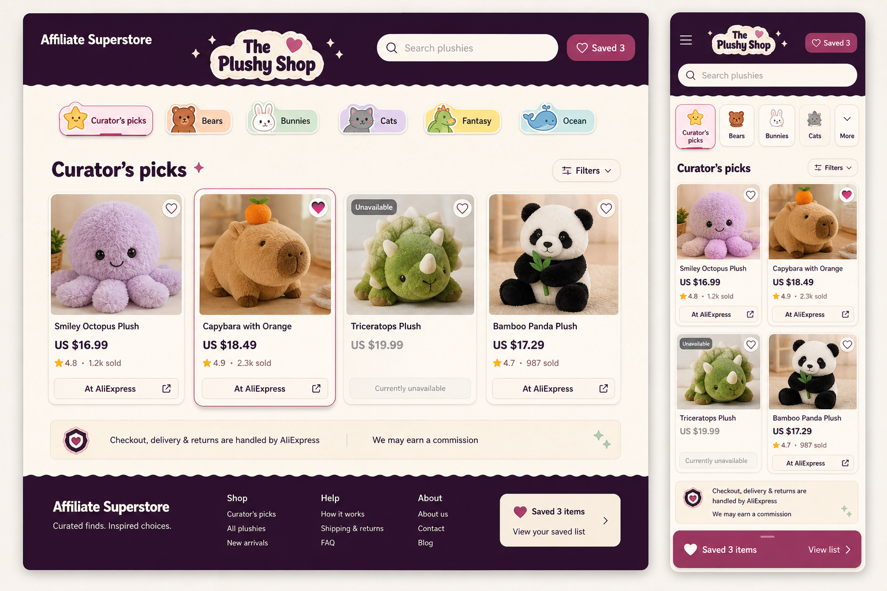
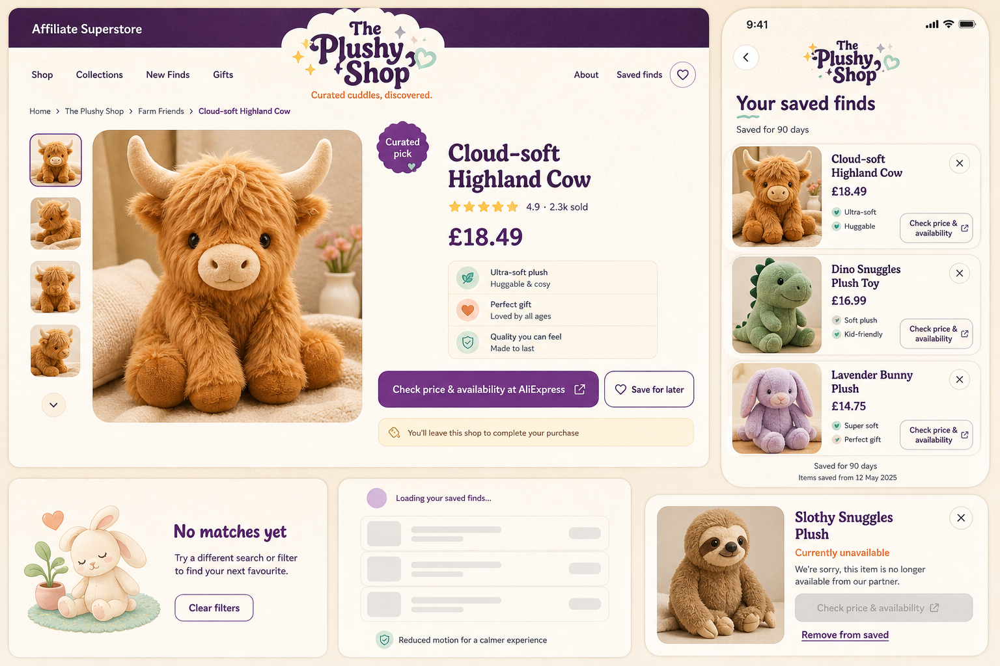
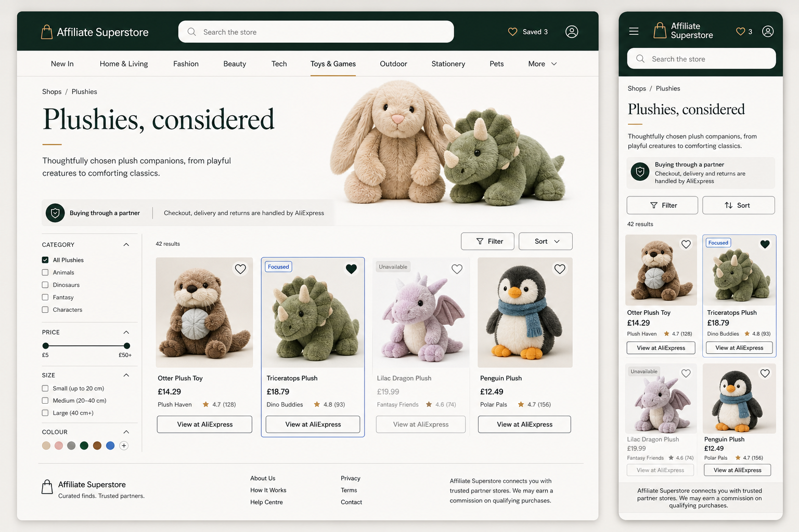
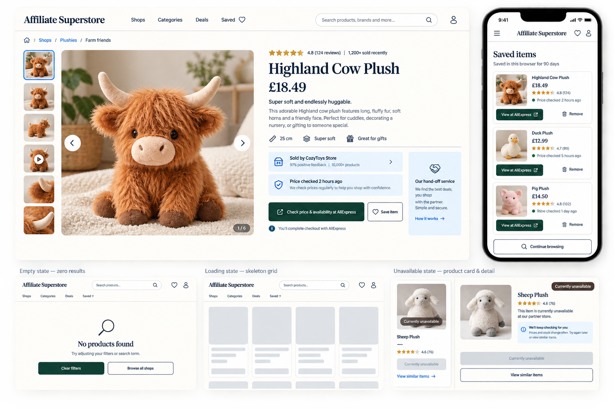
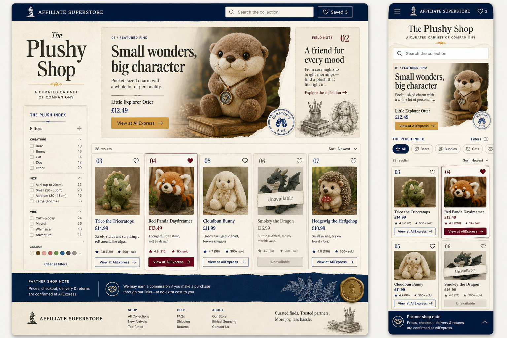
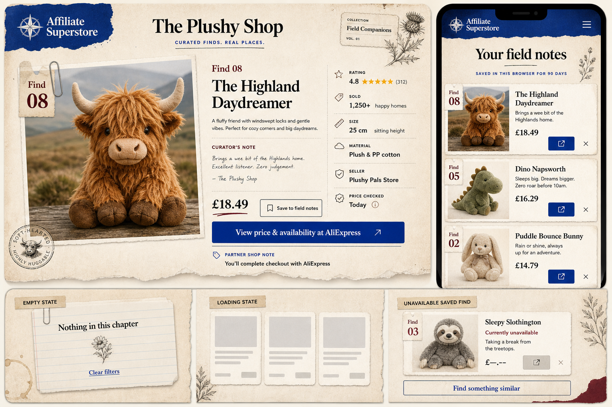

# Wonder Aisle design directions

Status: design exploration only  
Date: 30 August 2026  
Scope: public storefront; the admin remains a separate, calm operational UI

## What was reviewed

This exploration is grounded in the complete design-system brief, the current
Razor page information architecture, the existing semantic tokens and shop
theme configuration, and the running `/plushies` catalogue, product and saved
list pages at desktop and 390-pixel mobile widths.

The current site already establishes the correct trust model: visitors discover
products here, save them anonymously, and leave for current price, availability,
checkout, delivery and returns. Its main opportunity is hierarchy. Search,
filters, product facts and the affiliate hand-off currently read as adjacent
blocks rather than one guided shopping flow. The concepts below keep the same
information architecture while making that flow more intentional.

The mockups are ImageGen concept boards. They communicate hierarchy, density,
tone and state treatment; copy inside images is illustrative rather than a
pixel-accurate specification.

## Shared behaviour in all three directions

- Search remains a labelled form and filters remain real, URL-addressable
  controls. On mobile, filters move into a modal sheet with an explicit result
  count, Apply and Clear actions.
- A card opens an on-site product detail page. Its partner link is a separate,
  unambiguous action and always names AliExpress in text.
- Saved items are a comparison list, never a basket or checkout. The list states
  that it is anonymous and retained in the current browser for 90 days.
- The first meaningful outbound action is paired with a short hand-off note.
  The longer affiliate disclosure appears once per page in a consistent notice.
- Empty states preserve the current query, explain what happened and offer one
  recovery action. Loading uses stable skeleton geometry and no looping motion
  when reduced motion is requested. Unavailable products keep enough context to
  remove them from a saved list or find similar items.
- Keyboard focus is never communicated by colour alone. Interactive targets are
  at least 44 by 44 CSS pixels, including save, filter, remove and close controls.
- Prices are labelled as last checked, never implied to be guaranteed. Seller,
  rating and recent-sales facts are supporting evidence, not endorsements.

## Direction 1: Playful curator

### Design idea

A friendly specialist with excellent taste. Rounded display type, tactile paper
texture and small category characters make plushies joyful without turning the
site into a toy advert. Deep aubergine provides seriousness; apricot and mint are
supporting cues rather than candy-coloured backgrounds.

### Page and state treatment

- Desktop catalogue: compact shop masthead, prominent search, pictorial category
  chips, four-column cards and a persistent but quiet partner-service band.
- Mobile catalogue: search stays above the fold; categories scroll horizontally;
  products use a two-column grid; a bottom saved-list bar is present only after
  at least one item is saved.
- Product cards: square imagery, two-line title, price, one confidence fact and
  separate save/outbound actions. Saved uses a filled heart plus the word
  `Saved`; focus uses a two-layer teal ring; unavailable desaturates secondary
  facts but not the product image.
- Product detail: one large image, concise curator note, price and facts before
  the partner action. The hand-off sentence sits directly under that action.
- Saved list: compact image-led rows with one or two comparison facts. Remove is
  secondary and remains a labelled 44-pixel control.
- Empty/loading/unavailable: a single calm illustration may support an empty
  state; skeletons have the exact card footprint; an unavailable saved item keeps
  `Remove from saved` and offers similar products.

### Proposed type scale

Candidate locally hosted families: **Nunito Sans** for body and display, with
heavier rounded display cuts reserved for shop headings. Font files and licences
must be reviewed before implementation.

| Role | Desktop | Mobile | Weight / line height |
| --- | ---: | ---: | --- |
| Display / shop hero | 64 px | 40 px | 800 / 0.98 |
| Page title | 44 px | 34 px | 800 / 1.05 |
| Section title | 28 px | 24 px | 800 / 1.15 |
| Card title | 17 px | 15 px | 700 / 1.30 |
| Body | 16 px | 16 px | 500 / 1.55 |
| Small / helper | 14 px | 14 px | 600 / 1.45 |
| Metadata | 12 px | 12 px | 800 / 1.35, 0.06em tracking |

### Proposed semantic colour values

| Token role | Value | Intended use |
| --- | --- | --- |
| Brand | `#6D2E5B` | Primary actions, links, saved state |
| Accent | `#F4B860` | Badges and small highlights, not body text |
| Canvas | `#FFF8EE` | Shop page background |
| Surface | `#FFFFFF` | Cards, forms and notices |
| Text | `#2B1830` | Primary content |
| Muted | `#655966` | Supporting copy |
| Line | `#DCCFD7` | Card and control boundaries |
| Focus | `#08757B` | High-visibility focus ring |
| Success | `#1F6A52` | Availability and saved confirmation |
| Danger | `#A23A4A` | Errors and destructive confirmation only |

### Strength and risk

This direction is the best immediate expression of a plushies specialist. Its
risk is system drift: pictorial tabs, stickers and curved edges must be finite
profile assets, not permission for bespoke markup in every shop.

## Direction 2: Modern department store

### Design idea

A calm umbrella brand with the confidence of a well-edited department store.
Product photography, evidence and service language lead. Forest green creates
trust, mineral blue owns focus and information, and a restrained brass detail
adds warmth. The serif is an editorial accent, not a decorative layer.

### Page and state treatment

- Desktop catalogue: a stable umbrella masthead and category navigation, a short
  shop introduction, left filter rail and regular four-column product grid.
- Mobile catalogue: utility masthead and search, followed by equal Filter and
  Sort buttons. Active filters appear as removable chips below the controls.
- Product cards: strict image ratio and fact order make scanning and comparison
  easy. Saved, focus and unavailable states are explicit without changing card
  geometry.
- Product detail: gallery and facts use a two-column grid; the seller and
  price-checked facts sit close to the partner CTA; the hand-off is treated as a
  service explanation rather than fine print.
- Saved list: dense, calm rows preserve the same fact ordering as product cards.
  `Continue browsing` is primary navigation; partner actions remain per item.
- Empty/loading/unavailable: primarily typographic. No-result states offer Clear
  filters and Browse all; unavailable states retain facts and a similar-items
  path; skeletons use neutral blocks with no shimmer under reduced motion.

### Proposed type scale

Candidate locally hosted families: **Source Sans 3** for interface text and
**Newsreader** for category and product display headings. Font files and licences
must be reviewed before implementation.

| Role | Desktop | Mobile | Weight / line height |
| --- | ---: | ---: | --- |
| Display / shop hero | 58 px | 38 px | 500 / 1.02 |
| Page title | 42 px | 32 px | 550 / 1.08 |
| Section title | 26 px | 23 px | 650 / 1.20 |
| Card title | 16 px | 15 px | 650 / 1.35 |
| Body | 16 px | 16 px | 450 / 1.55 |
| Small / helper | 14 px | 14 px | 500 / 1.45 |
| Metadata | 12 px | 12 px | 650 / 1.35, 0.04em tracking |

### Proposed semantic colour values

| Token role | Value | Intended use |
| --- | --- | --- |
| Brand | `#123C35` | Masthead, primary actions and links |
| Accent | `#B47A16` | Small highlights and selected markers |
| Canvas | `#F4F2EC` | Shop page background |
| Surface | `#FFFFFF` | Cards and controls |
| Text | `#18201D` | Primary content |
| Muted | `#5E6663` | Supporting copy |
| Line | `#D4D9D6` | Grid and control boundaries |
| Focus | `#2369A7` | Keyboard focus and information cues |
| Success | `#1D6756` | Saved and available confirmation |
| Danger | `#9A3442` | Errors and destructive confirmation only |

### Strength and risk

This direction best supports many future shops and has the lowest trust and
accessibility risk. Its risk is anonymity. Shop profiles need a controlled
display face, photography treatment and accent asset so specialists do not all
look like the same catalogue with a colour swap.

## Direction 3: Editorial treasure hunt

### Design idea

A field guide to unusual finds. Numbered products, short curator notes and a
lead story turn browsing into discovery. Parchment, cobalt and oxblood feel
collected rather than nostalgic when paper edges and stamps are used sparingly.

### Page and state treatment

- Desktop catalogue: one featured find and one short story lead into an
  index-like filter rail and a regular underlying product grid. The apparent
  collage never changes semantic reading order.
- Mobile catalogue: the featured find compresses to a single card before the
  product index. Horizontal category chips replace the desktop filter rail.
- Product cards: a stable number, image, title, curator sentence, price and one
  confidence fact. A saved card adds an oxblood marker; focus adds a solid cobalt
  outline; unavailable uses a clear label and removes the outbound action.
- Product detail: photography and a short editorial note share attention, while
  seller and freshness facts remain a clean definition list.
- Saved list: `Your field notes` makes the list memorable but still explains the
  90-day anonymous behaviour. Partner actions remain individual.
- Empty/loading/unavailable: editorial metaphors appear only in the heading;
  recovery actions remain literal. Skeletons avoid simulated paper movement.

### Proposed type scale

Candidate locally hosted families: **Literata** for display, **IBM Plex Sans**
for body and **IBM Plex Sans Condensed** for metadata. Font files and licences
must be reviewed before implementation.

| Role | Desktop | Mobile | Weight / line height |
| --- | ---: | ---: | --- |
| Display / shop hero | 70 px | 42 px | 600 / 0.95 |
| Page title | 48 px | 34 px | 600 / 1.02 |
| Section title | 30 px | 24 px | 600 / 1.12 |
| Card title | 18 px | 16 px | 600 / 1.25 |
| Body | 16 px | 16 px | 450 / 1.58 |
| Small / helper | 14 px | 14 px | 500 / 1.45 |
| Metadata | 12 px | 12 px | 700 / 1.30, 0.10em tracking |

### Proposed semantic colour values

| Token role | Value | Intended use |
| --- | --- | --- |
| Brand | `#143A70` | Masthead, primary actions and links |
| Accent | `#D4A017` | Numbering and small highlights |
| Canvas | `#F3EBDD` | Shop page background |
| Surface | `#FFFDF7` | Cards and forms |
| Text | `#211D1A` | Primary content |
| Muted | `#655D55` | Supporting copy |
| Line | `#C9BBA7` | Rules, cards and index structure |
| Focus | `#175FB4` | Keyboard focus ring |
| Success | `#35634B` | Availability and saved confirmation |
| Danger | `#7A2232` | Saved emphasis, errors only when labelled |

### Strength and risk

This direction offers the most differentiated discovery experience. It also has
the highest editorial cost and the greatest risk that asymmetry or decorative
texture will reduce clarity, performance or theme portability. It is best for a
shop with a reliable supply of real curator notes and feature stories.

## Comparison

| Criterion | Playful curator | Modern department store | Editorial treasure hunt |
| --- | --- | --- | --- |
| Plushies personality | Excellent | Good | Very good |
| Umbrella-brand scalability | Fair | Excellent | Fair |
| Trust / hand-off clarity | Very good | Excellent | Very good |
| Catalogue scan speed | Good | Excellent | Fair–good |
| Content effort | Medium | Low | High |
| Profile portability | Good if assets are constrained | Excellent | Fair |
| Accessibility risk | Low–medium | Low | Medium |
| Distinctiveness | High | Medium | Very high |
| Best use | Friendly collectables | Shared system foundation | Story-rich specialist shop |

The subsequent refinement combines the Modern Department Store structure with
the Playful Curator plushies profile. Its resolved catalogue, product-detail and
saved-list boards are documented in [recommended-direction.md](recommended-direction.md).

## New reusable components and assets required

The list is intentionally short and profile-driven.

1. **Shop masthead** — umbrella brand, shop identity, search, saved count and a
   mobile menu treatment with one stable semantic structure.
2. **Filter surface** — desktop rail/bar and mobile sheet variants sharing the
   same fields, active-filter chips, result count, Apply and Clear actions.
3. **Product card state set** — default, hover, keyboard focus, saved, loading
   and unavailable, with invariant content and action order.
4. **Partner hand-off notice** — compact and full variants for catalogue,
   product detail and saved list; copy slots are controlled by the shared system.
5. **Saved-item row** — comparison facts, freshness, per-item outbound action,
   remove and unavailable variants.
6. **Status panel** — empty, error, loading and unavailable variants with a
   heading, explanation and one or two recovery actions.
7. **Profile asset pack** — locally hosted display font, optional paper texture,
   a small approved category-illustration set and photography treatment notes.
   Assets are declared by profile; pages do not select arbitrary decoration.

No new admin-specific themed component is proposed. Admin refinements should be
limited to the shared focus, control, notice and status behaviours.
