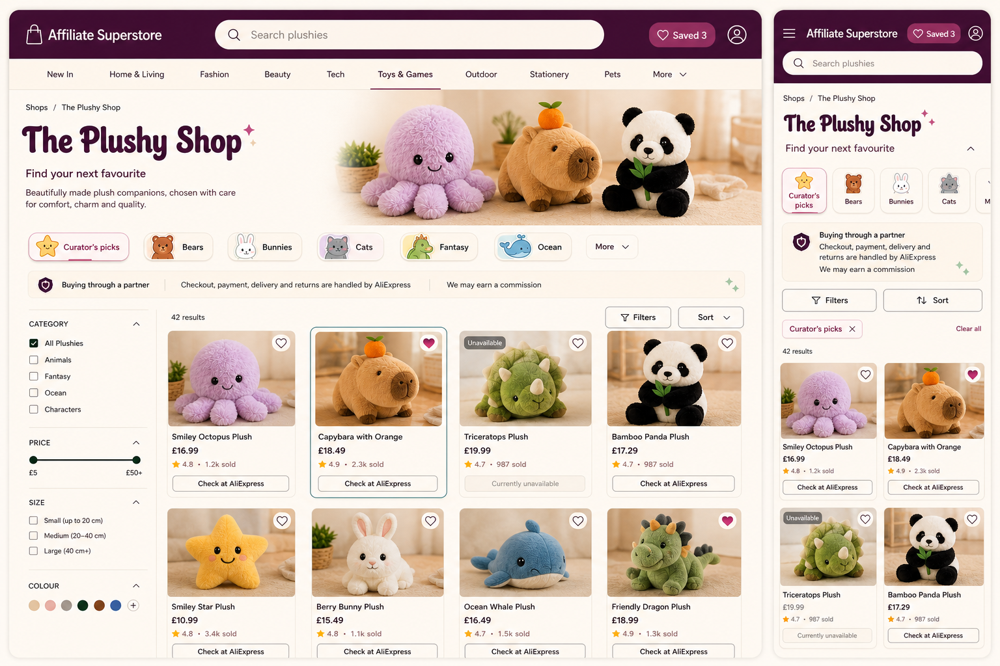
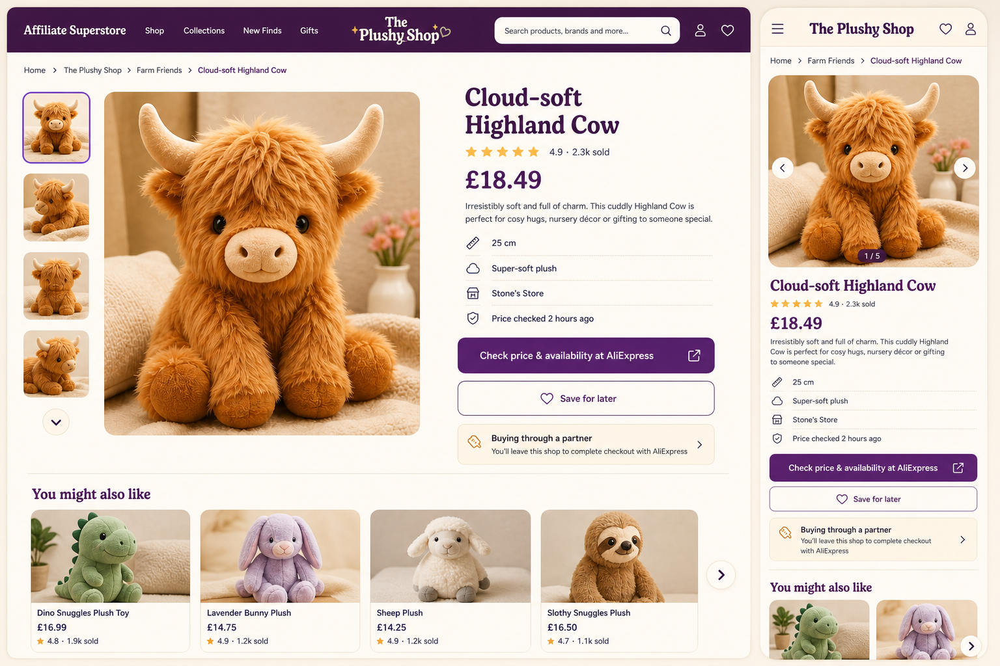
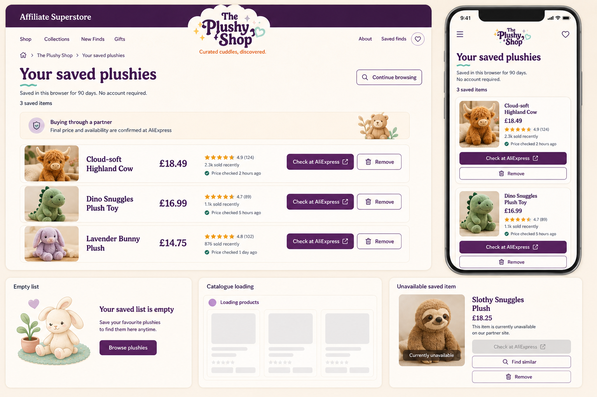

# Recommended direction

## Recommendation

Adopt **Modern department store** as the shared Wonder Aisle foundation.
Use **Playful curator** as the first controlled specialist profile for
`/plushies`, expressed through the existing shop theme contract rather than
through different page markup.

This is a recommendation for review, not approval to implement.

## Refined recommended-direction mockups

These boards resolve the recommended foundation and plushies profile into one
coherent system. They supersede any need to infer a hybrid from the earlier
Modern Department Store and Playful Curator boards.







The images remain directional visual specifications. Exact strings, product
data and decorative artwork must come from the application and approved asset
pack rather than being extracted from the PNGs.

## Resolved visual system

The refinement fixes the following decisions for review:

| Layer | Resolved decision |
| --- | --- |
| Umbrella shell | Compact aubergine masthead, global identity left, search central, saved list right |
| Shop identity | Text-first `The Plushy Shop`; rounded display role; no giant global hero |
| Catalogue layout | Regular grid and invariant card anatomy; filter rail at wide widths, sheet below 1024 px |
| Profile character | Warm cream canvas, warm-neutral photography, small approved category illustrations |
| Primary action | Solid brand fill with destination and purpose named in the label |
| Secondary action | Surface button with border; save and remove always use text as well as an icon |
| Focus | Teal two-layer ring, independent of brand and accent colours |
| Partner disclosure | Compact service notice before results and directly after the first product outbound action |
| Saved list | Comparison rows/cards with per-item outbound action; never cart or checkout framing |
| Decoration | Limited to category mini-illustrations, tiny heading spark and optional low-contrast grain |

## Refined page specifications

### Catalogue

The masthead and shop introduction should occupy no more than roughly 360 CSS
pixels on a 1440-pixel desktop viewport before the first product row begins.
Search is global in visual prominence but preserves the current shop query
scope. The category strip supplements rather than replaces the filter control.

Wide screens use a `240–280 px` filter rail and four flexible product columns.
The result header exposes result count, active filters and sort. A selected
category appears in both its control and the active-filter summary so state is
not communicated only by illustration or colour.

At mobile widths, the order is shop identity, search, category scroller, partner
notice, Filter/Sort actions, active-filter chips, result count and product grid.
Cards use two columns only while each column remains at least `148 px`; below
that threshold they become a single list with the image beside the card copy.

### Product detail

Desktop uses a roughly `56 / 44` media-to-copy split. The copy order is title,
confidence line, price, neutral description, facts, outbound action, save action
and hand-off notice. Seller and price freshness are factual rows, not trust
badges. The related-product row begins only after the primary decision block.

Mobile preserves the same semantic order. Gallery controls are 44-pixel targets
and expose image position in text. The outbound action is not sticky: it must not
cover disclosure, zoomed text or browser controls.

### Saved list

Desktop rows keep image, title, price, confidence/freshness, outbound action and
Remove in a stable left-to-right order. Mobile cards stack the individual
outbound and Remove actions at full width. An unavailable saved item keeps its
image and facts, removes the outbound link, and offers `Find similar` and
`Remove`.

There is no bulk `Open next item` action in the refined direction. It can imply a
purchase sequence and gives disproportionate emphasis to whichever product
happens to be first. `Continue browsing` is the page-level action.

## Responsive layout contract

| Range | Catalogue | Product detail | Saved list |
| --- | --- | --- | --- |
| `320–479 px` | One-column cards when two columns fall below 148 px; full-width Filter/Sort row | Single column; gallery, copy, actions, notice | Single-column cards; stacked actions |
| `480–767 px` | Two-column cards; horizontal category scroller | Single column; related cards scroll horizontally | Single-column cards; actions may share a row when labels fit |
| `768–1023 px` | Three-column grid; Filter opens sheet | Single column or balanced two-column at content test | Rows with image and copy; actions wrap below |
| `1024–1279 px` | 240 px rail plus three columns | Two-column gallery/copy | Full comparison rows |
| `1280 px+` | 260–280 px rail plus four columns | Two-column 56/44 split | Full comparison rows within 1180 px measure |

Breakpoints are content thresholds, not device names. The exact switch should be
validated with the longest imported title, 200% text zoom and translated
partner-action copy.

## Product-card anatomy and states

All states keep the same content order and footprint:

1. Product-detail link wrapping the square image.
2. Labelled save control in the media corner.
3. Two-line product title linked to the on-site detail page.
4. Current observed GBP price or `Check current price`.
5. One confidence line: rating and recent sales when present.
6. Separate partner action labelled `Check at AliExpress`.

| State | Required change |
| --- | --- |
| Default | Neutral border and surface |
| Hover | Border/elevation change only; action order does not move |
| Keyboard focus | Teal outer ring plus surface gap around the focused control/card link |
| Saved | Filled heart and visible `Saved` name or accessible state announcement |
| Loading | Geometry-matched skeleton; no interaction and no shimmer under reduced motion |
| Unavailable | Text label, muted price, no outbound link, preserved detail/removal path |

## Resolved storefront copy

| Placement | Copy |
| --- | --- |
| Catalogue introduction | `Find your next favourite` |
| Catalogue partner heading | `Buying through a partner` |
| Catalogue partner body | `Checkout, payment, delivery and returns are handled by AliExpress. We may earn a commission.` |
| Card outbound action | `Check at AliExpress` |
| Product outbound action | `Check price & availability at AliExpress` |
| Product hand-off | `You’ll leave this shop to complete checkout with AliExpress.` |
| Saved-list retention | `Saved in this browser for 90 days. No account required.` |
| Saved-list partner body | `Final price and availability are confirmed at AliExpress.` |
| Unavailable recovery | `Find similar` and `Remove` |

The longer legal disclosure remains available once per page. These short forms
support comprehension and do not replace final legal review.

## Why this direction wins

Wonder Aisle has two simultaneous jobs: feel like a useful specialist
shop and be unmistakably honest about the partner hand-off. Modern Department
Store creates the clearest hierarchy for both. Search, filtering, price
freshness, seller evidence, saved items and the AliExpress action all have a
stable place. It also remains credible when the product category changes from
plushies to a less playful shop.

The direction performs best against the brief's durable constraints:

- **Trust:** the umbrella masthead and partner-service language are calm and
  explicit. Nothing resembles AliExpress branding or implies an on-site checkout.
- **Scale:** a regular grid, stable fact order and restrained shell can serve
  shops with very different products, image quality and catalogue sizes.
- **Accessibility:** contrast, focus, control boundaries and reading order do
  not depend on decoration. Mobile compression is straightforward down to 320
  CSS pixels.
- **Maintainability:** most variation can live in the existing five colour
  values, one named profile, approved type roles and an asset pack. Components
  remain shared.
- **Operational realism:** this direction does not require a constant supply of
  feature stories or bespoke illustrations before a shop looks complete.

## Why the recommendation still uses Playful curator

A completely neutral Modern Department Store treatment would under-deliver on
the first principle: a curated specialist shop, not a generic marketplace.
`/plushies` should therefore use the Playful Curator profile values, warmer
photography, rounded display role and finite category illustrations while
keeping the Modern Department Store component structure and fact hierarchy.

That means the system relationship is:

```text
Shared shell and behaviour       Modern department store
Plushies profile expression      Playful curator
Optional future story profile    Editorial treasure hunt
Admin                            Existing operational language
```

This is not a visual mash-up. The shell owns layout, semantics, states and
interaction. The profile owns only the documented colour, type, radius, asset
and photography recipe.

## What to carry forward

From Modern Department Store:

- umbrella masthead and search hierarchy;
- filter rail on wide screens and filter sheet on mobile;
- invariant product-card information order;
- product-detail gallery/facts/action structure;
- per-item saved-list actions and price-freshness cues;
- service-style partner hand-off notice;
- restrained empty, loading and unavailable patterns.

From Playful Curator for the plushies profile:

- deep aubergine and warm cream palette;
- rounded display role and slightly softer component radii;
- small, approved category illustrations;
- warm, uncluttered product photography;
- friendly microcopy such as `Find your next favourite`, while partner and
  status language remains literal.

Reserve from Editorial Treasure Hunt:

- numbered finds and short curator notes as optional component features;
- a story-lead module for shops with real editorial content;
- the profile itself for a later, content-rich specialist shop.

## What not to carry forward

- A global giant hero that pushes search results below the fold.
- Decorative paper edges, stamps or category characters embedded in page
  markup. They must be optional profile assets.
- Marketplace patterns such as urgency timers, aggressive discount colour,
  platform logos, cart language or a fake on-site checkout.
- Save controls represented only by an unlabelled heart.
- Partner disclosure isolated at the bottom of the page or reduced to fine print.
- Masonry that changes semantic order, variable card heights that obscure
  comparison, auto-advancing carousels or looping skeleton shimmer.
- A separate layout or CSS bundle for each specialist shop.

## Recommended first review prototype

After visual review, and only in a separate implementation task, validate one
shared vertical slice rather than restyling every page:

1. Catalogue header, search, filter controls and four product-card states at
   320, 390 and 1440 CSS pixels.
2. One product detail page with the partner hand-off note adjacent to the first
   outbound action.
3. One populated and one empty saved list.
4. Keyboard-only, forced-colours, reduced-motion, 200% text zoom and long-title
   checks.
5. Both the neutral Modern Department Store profile and Playful Curator profile
   applied to the same markup.

The review should reject the approach if either profile needs structural markup
changes, if configured colours cannot be validated automatically, or if the
partner hand-off becomes less clear at mobile widths.

## Decision summary

Modern Department Store is the best system; Playful Curator is the best first
shop expression. This combination delivers personality without turning theme
configuration into arbitrary per-shop CSS, and it leaves Editorial Treasure Hunt
available as a deliberately higher-content profile rather than forcing that cost
onto every catalogue.
